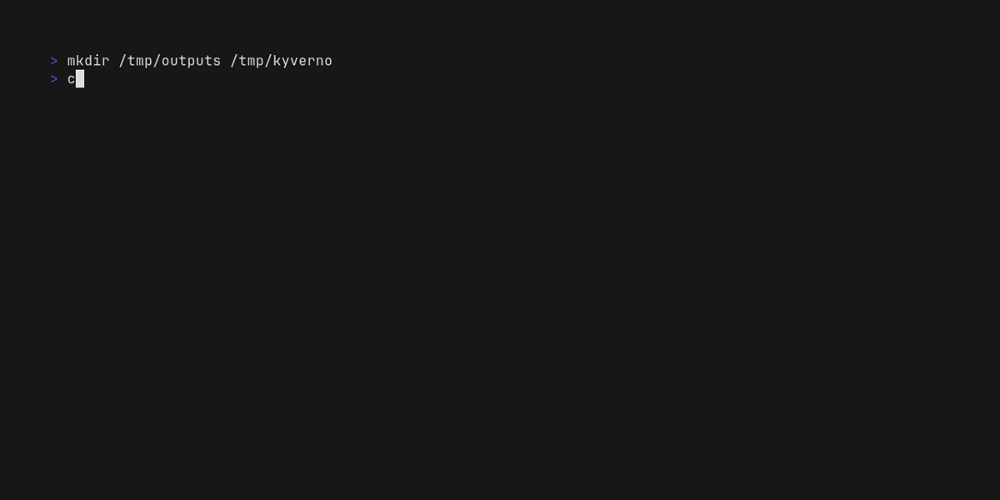

# compliance-to-policy-go


#  Compliance-to-Policy (also known as `C2P`)

## C2P Overview
Compliance-to-Policy (C2P) is designed to bridge Compliance as Code such as Open Security Controls Assessment Language (OSCAL) and Policy as Code used by Policy Validation Point (PVP).
It generates policies in the native format of PVP from OSCAL Component Definitions and produces OSCAL Assessment Results from the native assessment results of PVP.
C2P can be used both as a command-line tool and a library, making it easy and flexible to integrate into your Continuous Compliance pipelines, such as GitHub Actions, Tekton Pipelines, or Agile Authoring Pipelines.


1. Compliance-to-Policy (C2P) is running in GitOps Pipeline, Kubernetes controller, or Python/Go environment
2. C2P receives Compliance as Code, for example OSCAL Component Definition that represents mapping between controls and policies (policy names/ids)
3. C2P generates policies through plugin for each policy engine
    - The plugin is responsible for implementing a function that takes policy names/ids and returns policies
4. Policies are delivered to policy engines by GitOps sync, the subsequence pipeline task, Kubernetes controller, or a deployment automation program
5. Results are collected from policy engines by a scheduled task or Kubernetes controller
6. C2P aggregates the results of policy engines by controls through plugin for each policy engine
    - The plugin is responsible for implementing a function that takes the results of the policy engine and returns verdicts (pass/fail/error), reason, and/or resource name for each respective policy by its names/IDs.
7. C2P produces Compliance Assessment Results, for example OSCAL Assessment Results that represents the assessment results of each control

### C2P Goals
Provide seamless integration with compliance frameworks and existing policy engines, and enables use of heterogeneous policy engines in compliance check operation
- Flexibility in choice of policy engines and compliance frameworks
    - Provide plugins to cover various policy engines including proprietary/open source policy validation/enforcement engines, or in-house policy validation/enforcement program
    - Cover various compliance frameworks not only OSCAL but also other GRC frameworks and Cloud Security Posture Management services
- Community-driven plugin extension
    - Provide an efficient plugin interface and development method

## Versions

C2P Go follows [Semantic Versioning](https://semver.org/). All backward-incompatible changes are reserved for
the next major release (2).

#### v1: stable
All v1.* releases are based upon the `v1` branch.

#### v2: experimental
The `main` branch is where all `v2` module development occurs.

Note that this version is under initial development and the API may change incompatibly from one commit to another on the `main` branch until the `v2` module is released as stable. If importing, you should use the main branch (or a specific commit hash) for this module in your project's `go.mod`.

If you are seeking stability over new features, you are highly encouraged to use releases with major version 1.

## About C2P Go `v2`

C2P-Go is the Go-based implementation of the Compliance-to-Policy (C2P) framework with the overall goal to bridge
compliance definitions (e.g. OSCAL) and native policy formats for various tools.

To support the diverse ecosystem of policy engines and adapt to future policy-as-code solutions, C2P-Go leverages a gRPC-based plugin system to support
communication with plugins written in different languages.

### Components

**Plugin API Spec**: Interfaces for communication between C2P core (gRPC clients) and the plugins (gRPC services) are defined using `protobuf` to support code generation in other languages and type safety.  
**C2P Core (Framework Implementation)**: C2P Core is the host application extended by the plugins. It manages the plugin lifecycle and gRPC clients for plugin communication.  
**Plugin-Kit**: Shared logic for C2P core and Go-based plugins is located in the `plugin` package.

### Supported Compliance Frameworks
- [Open Security Controls Assessment Language (OSCAL)](https://pages.nist.gov/OSCAL/documentation/)
    - OSCAL standard provides a compliance framework and the corresponding set of key compliance artifacts expressed in machine processable formats enabling all compliance documents to be treated as code and therefore processed and managed in the same manner.

### Supported Policy Engines

C2P-Go supports multiple PVP engines, including Kyverno and Open Cluster Management Policy Framework, through dedicated plugins for each.
Custom plugins can be implemented with a small amount of Go code.

- [Kyverno](https://kyverno.io/) (for Kubernetes resources)
    - Kyverno is a policy engine designed for Kubernetes, where policies are managed as Kubernetes resources. Kyverno policies can validate, mutate, generate, and clean up Kubernetes resources.
    - [C2P for Kyverno](/docs/kyverno/README.md)
- [Open Cluster Management Policy Framework](https://open-cluster-management.io/) (for Kubernetes resources)
    - OCM is a multi-cluster management platform that provides governance of Kubernetes policies. [Its policy framework](https://open-cluster-management.io/concepts/policy/) allows for the validation and enforcement of policies across multiple clusters.
    - [C2P for OCM](/docs/ocm/README.md)

### Quick Start

The below steps illustrate a simple demo on how the C2P CLI can be used with supported plugins and provided test inputs.

- Install prerequisites [kustomize](https://kubectl.docs.kubernetes.io/installation/kustomize/binaries/) and [policy-generator plugin](https://github.com/open-cluster-management-io/policy-generator-plugin?tab=readme-ov-file).
- Review the [Quickstart](./docs/QUICK_START.md) for additional information on plugin building and setup.



> For more information on how to use C2P as a library for plugin building, see the plugin [README.md](./plugin/README.md)

## Contributing

Our project welcomes external contributions. Please consult [contributing](./CONTRIBUTING.md)

## Code of Conduct

Participation in the OSCAL Compass community is governed by the [Code of Conduct](https://github.com/oscal-compass/community/blob/main/CODE_OF_CONDUCT.md).

## License & Authors

If you would like to see the detailed LICENSE click [here](LICENSE).
Consult [contributors](https://github.com/oscal-compass/compliance-to-policy/graphs/contributors) for a list of authors and [maintainers](MAINTAINERS.md) for the core team.

```text
# Copyright (c) 2025 The OSCAL Compass Authors. All rights reserved.
#
# Licensed under the Apache License, Version 2.0 (the "License");
# you may not use this file except in compliance with the License.
# You may obtain a copy of the License at
#
#     https://www.apache.org/licenses/LICENSE-2.0
#
# Unless required by applicable law or agreed to in writing, software
# distributed under the License is distributed on an "AS IS" BASIS,
# WITHOUT WARRANTIES OR CONDITIONS OF ANY KIND, either express or implied.
# See the License for the specific language governing permissions and
# limitations under the License.

```
______________________________________________________________________

We are a Cloud Native Computing Foundation sandbox project.

<picture>
  <source media="(prefers-color-scheme: dark)" srcset="https://www.cncf.io/wp-content/uploads/2022/07/cncf-white-logo.svg">
  
</picture>

The Linux Foundation® (TLF) has registered trademarks and uses trademarks. For a list of TLF trademarks, see [Trademark Usage](https://www.linuxfoundation.org/legal/trademark-usage)".

*Compliance to Policy was originally created by IBM.*